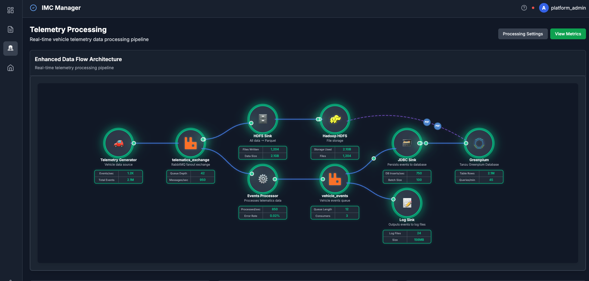
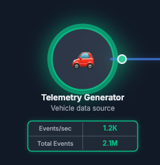
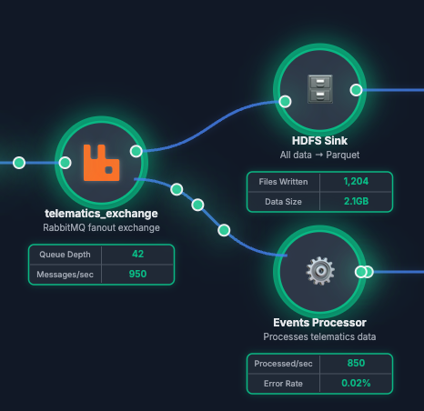

# 🎨 Diagram Designer

<div align="center">



**🚀 Interactive System Architecture Visualization Platform**

[](https://reactjs.org/)
[](https://www.typescriptlang.org/)
[](https://vitejs.dev/)
[](https://reactflow.dev/)
[](https://tailwindcss.com/)

*Create stunning, interactive system diagrams with real-time metrics, animated particles, and dynamic status monitoring*

[🌐 Live Demo](#-deployment) | [📖 Documentation](#-configuration-guide) | [🚀 Quick Start](#-quick-start)

</div>

---

## ✨ Features

<table>
<tr>
<td width="50%">

### 🎯 **Core Features**
- 🏗️ **Interactive Node-Based Diagrams**
- 📊 **Real-Time Metrics Display**
- ✨ **Animated Particle Flows**
- 🔄 **Live Status Monitoring**
- 🎨 **Customizable Styling & Themes**
- 🔗 **Smart Connection Management**
- 📱 **Responsive Design**

</td>
<td width="50%">

### 🚀 **Advanced Features**
- 🖱️ **Drag & Drop Positioning**
- 💾 **Persistent Layout Storage**
- 📂 **Multiple Diagram Support**
- 🔧 **JSON Configuration Editor**
- 📍 **Live Coordinate Display**
- 🌐 **Clickable Components**
- ☁️ **Cloud Foundry Ready**

</td>
</tr>
</table>

---

## 🎥 Preview

<div align="center">


*Main diagram interface with animated particles and real-time metrics*


*Comprehensive settings and JSON editor*

</div>

---

## 🚀 Quick Start

### 📋 Prerequisites

- **Node.js** 18+ 
- **npm** or **yarn**

### ⚡ Installation & Development

```bash
# 🔄 Clone the repository
git clone <repository-url>
cd diagram-designer

# 🎯 Start local development
./deploy-local.sh
```

**🌐 Open your browser to:** `http://localhost:5175`

### 🏗️ Build & Deploy

```bash
# 📦 Production build
./deploy-local-prod.sh

# ☁️ Deploy to Cloud Foundry
./deploy.sh
```

---

## 🎨 Component Gallery

### 🎭 **Icon Types Supported**

<table>
<tr>
<td align="center"><h4>📱 FontAwesome</h4></td>
<td align="center"><h4>🖼️ Local Images</h4></td>
<td align="center"><h4>😀 Emoji Icons</h4></td>
</tr>
<tr>
<td>

```json
{
  "icon": "fas fa-server",
  "icon": "fas fa-database",
  "icon": "fas fa-cloud"
}
```

</td>
<td>

```json
{
  "icon": "/assets/icons/rabbitmq.svg",
  "icon": "/assets/icons/hadoop.svg",
  "icon": "/assets/icons/tanzu.png"
}
```

</td>
<td>

```json
{
  "icon": "🚗",
  "icon": "🗄️", 
  "icon": "⚙️",
  "icon": "🗃️",
  "icon": "📝"
}
```

</td>
</tr>
</table>

### 🎨 **Connection Styles**

| Type | Visual | Description |
|------|--------|-------------|
| **🔗 Default** | `━━━━━` | Standard ReactFlow edges |
| **🌊 Curved** | `╭─────╮` | Smooth curved lines |
| **📐 Step** | `┌──┐` | Angular stepped lines |
| **➡️ Straight** | `─────` | Direct straight lines |
| **✨ Particle** | `━✨━✨━` | Animated particle flows |

---

## 📊 Configuration Guide

### 🔧 **Global Settings**

```json
{
  "config": {
    "layout": "horizontal",           // 📐 Layout direction
    "updateInterval": 30000,         // ⏰ Metrics refresh rate (ms)
    "title": "My System Diagram",    // 📋 Diagram title
    "nodeGlow": {                    // ✨ Global glow effects
      "enabled": true,               // 🔘 Enable glow
      "intensity": 8,                // 💡 Glow strength (1-20)
      "spread": 12                   // 📏 Glow radius (px)
    }
  }
}
```

### 🏗️ **Node Configuration**

#### **📋 Required Properties**

| Property | Type | Description | Example |
|----------|------|-------------|---------|
| **🏷️ name** | `string` | Unique identifier | `"webserver"` |
| **📝 displayName** | `string` | Display name | `"Web Server"` |
| **📄 description** | `string` | Component description | `"Frontend web server"` |
| **🎨 icon** | `string` | Icon specification | `"fas fa-server"` |
| **📊 dataGrid** | `array` | Metrics configuration | `[{...}]` |

#### **⚙️ Optional Properties**

<details>
<summary><b>📍 Position Settings</b></summary>

```json
{
  "position": {
    "x": 100,    // 📐 X coordinate
    "y": 200     // 📐 Y coordinate
  }
}
```
</details>

<details>
<summary><b>🔗 Connection Configuration</b></summary>

```json
{
  "connectTo": ["NodeName"],           // 🔗 Simple connection
  "connectTo": [{                      // 🔧 Advanced connection
    "target": "NodeName",              // 🎯 Target node
    "outputHandle": 0,                 // 📤 Output handle index
    "inputHandle": 0                   // 📥 Input handle index
  }]
}
```

**🧠 Connection Logic:**
- 📊 **Right-to-Left Definition**: Node B connects TO Node A
- 🔄 **Visual Flow**: Left to Right (A → B)
- ⚡ **Data Flow**: A sends data TO B

</details>

<details>
<summary><b>✨ Particle Animation</b></summary>

```json
{
  "particles": {
    "enabled": true,        // 🔘 Enable particles
    "speed": 5,            // 🏃 Speed (1=slow, 10=fast)
    "count": 5,            // 🔢 Particle count
    "color": "#3498db",    // 🎨 Particle color
    "direction": "source", // 📍 Flow direction
    "glow": true,          // ✨ Glow effect
    "pulse": true          // 💓 Pulsing animation
  }
}
```

**🎯 Direction Options:**
- **📤 source**: Particles flow OUT of this node
- **📥 target**: Particles flow INTO this node

</details>

<details>
<summary><b>🔌 Handle Configuration</b></summary>

```json
{
  "handles": {
    "input": 2,     // 📥 Left side handles
    "output": 3     // 📤 Right side handles
  }
}
```
</details>

<details>
<summary><b>🔄 Status Monitoring</b></summary>

```json
{
  "status": {
    "url": "https://api.example.com/health",    // 🌐 Health endpoint
    "key": "bearer-token-123",                  // 🔐 Auth token
    "valueField": "status",                     // 📊 Status field
    "upValue": "healthy",                       // ✅ "Up" value
    "downValue": "unhealthy",                   // ❌ "Down" value
    "updateInterval": 10000                     // ⏰ Check interval
  }
}
```
</details>

<details>
<summary><b>🌐 Clickable Links</b></summary>

```json
{
  "url": "https://dashboard.example.com"       // 🔗 Click destination
}
```

- 🖱️ **Click Action**: Opens URL in new tab
- 🎨 **Visual Feedback**: Hover effects and pointer cursor
- 🛡️ **Secure**: Opens in new window/tab

</details>

### 📊 **Metrics Configuration**

```json
{
  "dataGrid": [
    {
      "label": "CPU Usage",                    // 📋 Metric label
      "key": "cpu-api-key",                    // 🔑 API key
      "url": "https://api.example.com/cpu",    // 🌐 Data endpoint
      "valueField": "percentage"               // 📊 JSON field to extract
    }
  ]
}
```

---

## 🎨 Styling & Themes

### 🌈 **Color Palette**

| Color | Hex | Usage |
|-------|-----|-------|
| 🔵 **Primary Blue** | `#3498db` | Default connections |
| 🟢 **Success Green** | `#2ecc71` | Status indicators |
| 🔴 **Error Red** | `#e74c3c` | Error states |
| 🟠 **Warning Orange** | `#f39c12` | Warnings |
| 🟣 **Accent Purple** | `#9b59b6` | Special highlights |

### ✨ **Glow Effects**

```json
{
  "nodeGlow": {
    "enabled": true,        // 🔘 Master toggle
    "intensity": 8,         // 💡 Brightness (1-20)
    "spread": 12           // 📏 Radius (pixels)
  }
}
```

**🎨 Glow Colors**: Automatically derived from node circle colors

---

## 🛠️ Advanced Features

### 📂 **Multi-Diagram Support**

- 🗂️ **Automatic Discovery**: Scans `public/` directory for JSON files
- 🔄 **Dynamic Switching**: Change diagrams without refresh
- 💾 **Persistent Selection**: Remembers last selected diagram
- 🚀 **Auto-Detection**: New JSON files automatically appear in selector

#### 🔄 **Auto-Detection Workflow**

1. **📁 Add JSON File**: Place your diagram JSON file in `frontend/public/`
2. **🔄 Update List**: Run `./update-diagram-list.sh` to scan and update the file list
3. **✨ Auto-Appear**: Your diagram automatically appears in the selector dropdown
4. **🎯 Select & Use**: Choose your diagram from the dropdown and start using it

**Example:**
```bash
# Add your new diagram file
cp my-diagram.json frontend/public/

# Update the diagram list
./update-diagram-list.sh

# Your diagram now appears in the UI! 🎉
```

### 🖱️ **Interactive Positioning**

- 🏃 **Drag & Drop**: Move components freely
- 📍 **Live Coordinates**: Optional coordinate display while dragging
- 💾 **Position Persistence**: Saves positions automatically
- 📁 **Layout Export**: Download current layout as JSON

### 🔧 **JSON Configuration Editor**

- 👁️ **View Mode**: Read-only formatted display
- ✏️ **Edit Mode**: Full text editor with syntax validation
- 🔄 **Live Position Merge**: Automatically includes current positions
- 💾 **Safe Download**: Validation prevents invalid JSON export

---

## 🌐 Deployment

### 🏠 **Local Development**

```bash
# 🔧 Development server with hot reload
./deploy-local.sh

# 🏭 Production build served locally
./deploy-local-prod.sh

# 🔄 Update diagram list (when adding new JSON files)
./update-diagram-list.sh
```

### ☁️ **Cloud Foundry**

```bash
# 🚀 Deploy to Cloud Foundry
./deploy.sh
```

**📋 Required Files:**
- `manifest.yml` - CF application manifest
- `Staticfile` - Buildpack configuration
- `deploy.sh` - Automated deployment script

---

## 📖 Icon Reference

### 🎭 **FontAwesome Icons**

<details>
<summary><b>🖥️ Technology Icons</b></summary>

```json
{
  "icon": "fas fa-server",        // 🖥️ Server
  "icon": "fas fa-database",      // 🗄️ Database  
  "icon": "fas fa-cloud",         // ☁️ Cloud
  "icon": "fas fa-network-wired", // 🌐 Network
  "icon": "fas fa-microchip",     // 💾 CPU
  "icon": "fas fa-memory",        // 🧠 Memory
  "icon": "fas fa-hdd",           // 💿 Storage
  "icon": "fas fa-globe",         // 🌍 Web
  "icon": "fas fa-shield-alt",    // 🛡️ Security
  "icon": "fas fa-cogs"           // ⚙️ Settings
}
```
</details>

<details>
<summary><b>📊 Data & Analytics</b></summary>

```json
{
  "icon": "fas fa-chart-bar",     // 📊 Analytics
  "icon": "fas fa-chart-line",    // 📈 Metrics
  "icon": "fas fa-tachometer-alt", // 📊 Dashboard
  "icon": "fas fa-search",        // 🔍 Search
  "icon": "fas fa-filter",        // 🔽 Filter
  "icon": "fas fa-sort",          // ↕️ Sort
  "icon": "fas fa-table"          // 📋 Table
}
```
</details>

### 🔗 **Resource Links**

- 🎨 **FontAwesome Gallery**: https://fontawesome.com/icons
- 🆓 **Free Icons**: https://fontawesome.com/icons?d=gallery&m=free
- 🔍 **Icon Search**: https://fontawesome.com/search

---

## 🤝 Contributing

### 🛠️ **Development Setup**

```bash
# 📥 Install dependencies
cd frontend && npm install

# 🔧 Start development server
npm run dev

# 🏗️ Build for production
npm run build

# 🧪 Run tests
npm run test
```

### 📋 **Code Standards**

- ✅ **TypeScript**: Strict type checking enabled
- 🎨 **ESLint**: Code quality enforcement
- 💅 **Prettier**: Consistent formatting
- 🧪 **Testing**: Jest + React Testing Library

---

## 📄 License

This project is licensed under the MIT License - see the [LICENSE](LICENSE) file for details.

---

<div align="center">

**🎨 Made with ❤️ using React, TypeScript, and ReactFlow**

[⬆️ Back to Top](#-diagram-designer)

</div>
